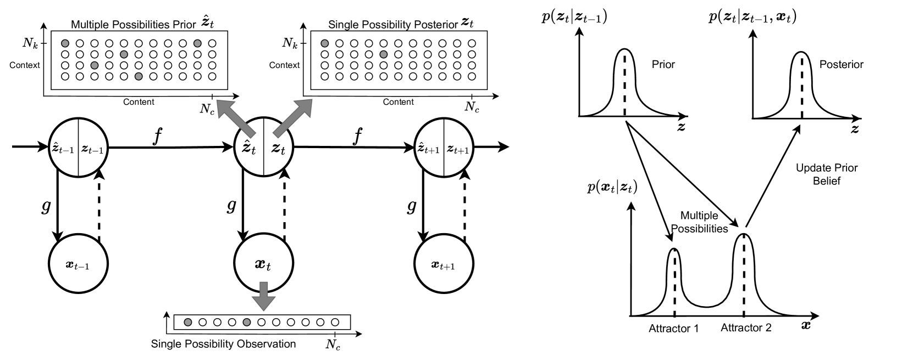
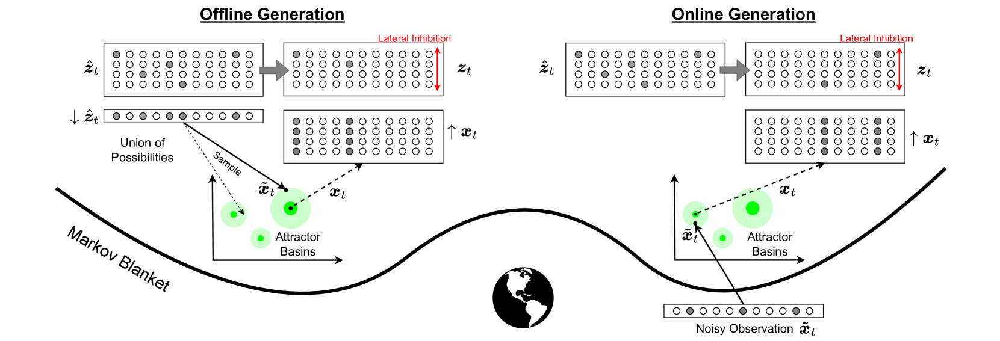

# Predictive Attractor Models
Official repository for the paper "[Predictive Attractor Models](https://arxiv.org/abs/2410.02430)" published at NeurIPS 2024.

<p align="center">
  
</p>

---

## Environment Setup
1. Clone repository
```sh
git clone git@github.com:ramyamounir/pam.git
cd pam
```

2. Create and activate conda environment 
```sh
conda env create -f env.yml
conda activate pamenv
```

3. Use PamModel to learn and generate sequences
```python
from src.models.pam import PamModel
from src.utils.configs import get_pam_configs
from src.utils.exps import accuracy_SDR
from src.utils.sdr import SDR

# create two sequence
seq1 = [SDR(N=100, S=5) for _ in range(10)]
seq2 = [SDR(N=100, S=5) for _ in range(10)]

# Instantiate model with default parameters
pam = PamModel(N_c=100, N_k=4, W=5, **get_pam_configs())

# Learn two sequence
pam.learn_sequence(seq1)
pam.learn_sequence(seq2)

# generate the first sequence
recall = pam.recall_sequence_offline(seq1[0], len(seq1) - 1)

# Calculate accuracy (IoU)
print(accuracy_SDR(seq1, recall))
```

<p align="center">
  
</p>

--- 

## Paper Results Reproducibility

* We provide scripts for all experiments in the paper and supplementary results. The scripts are provided in the `src/experiments` directory.
* Vision experiments require running the sparse auto-encoder scripts, which are also provided under `src/experiments`.
* The `data` directory should contain the raw datasets. We have included ProteinNet and Words, but others (e.g., Moving MNIST, CLEVRER) should be downloaded from the respective sources.

---


Citing PAM
-------
If you find our approaches useful in your research, you can cite our paper:
```
@inproceedings{mounir2024predictive,
  title={Predictive Attractor Models},
  author={Mounir, Ramy and  Sarkar, Sudeep},
  booktitle={Thirty-eighth Conference on Neural Information Processing Systems},
  year={2024}
}
```


